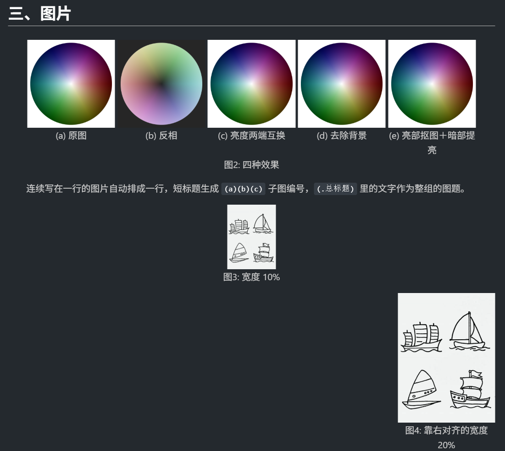
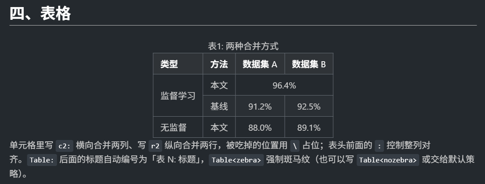
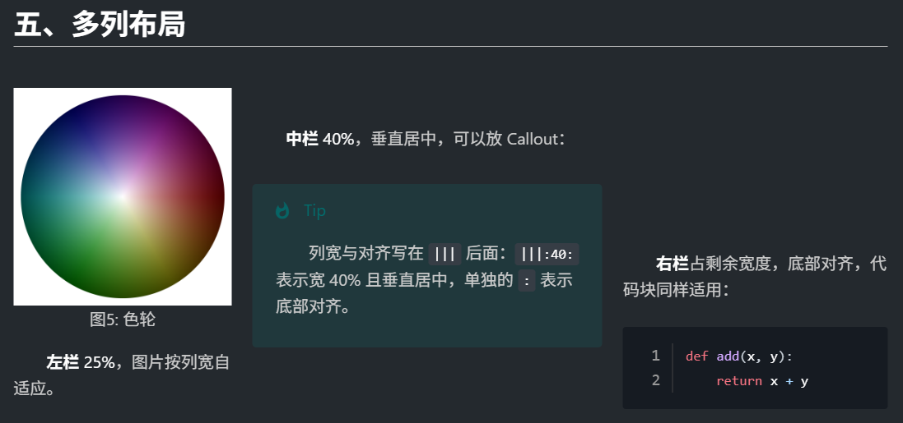
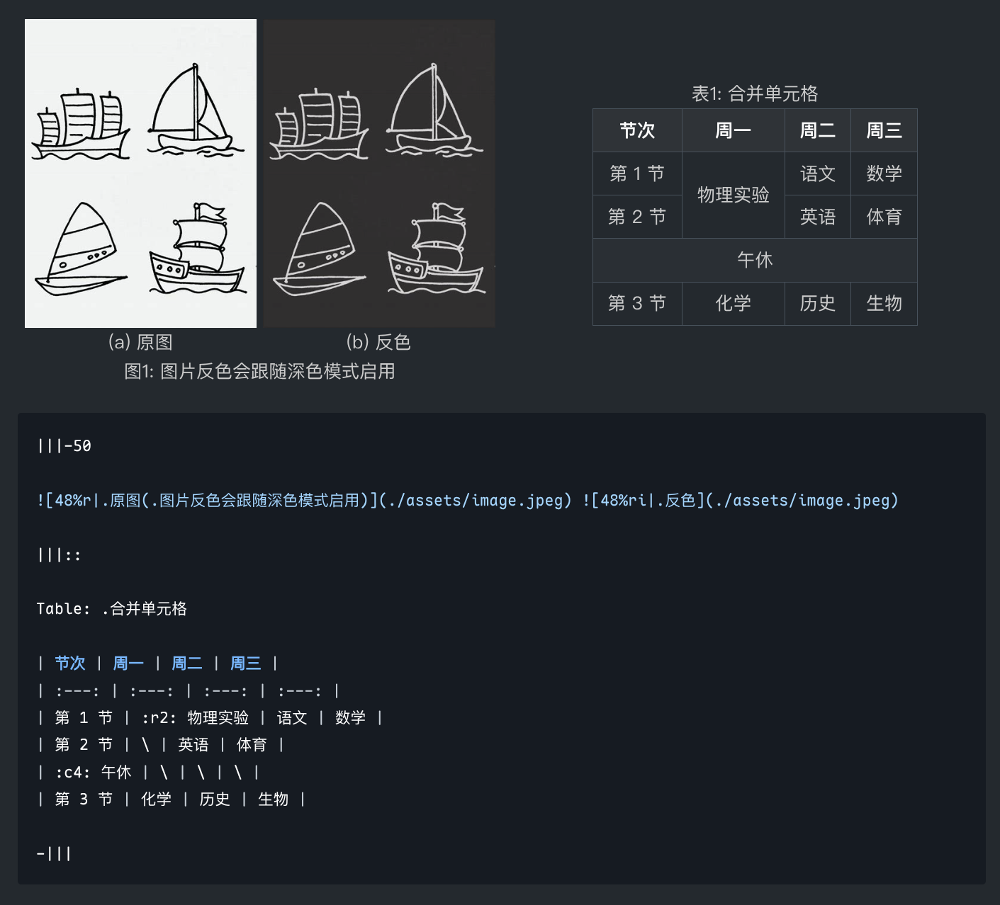

# MdCSS：Beyond Markdown

**使用文档** · [功能演示](docs/demo.md) · [语法文档](docs/SYNTAX.md) · [在线预览](https://suif4599.github.io/mdcss/) · [参数列表](docs/config.md) · [Nix 安装](docs/install_nix.md) · [Inkstone 桥接](docs/inkstone.md)

MdCSS 是一个用 Python 编写的 Markdown 扩展生成器。它读取配置，生成宿主可识别的样式与脚本，为 Markdown 增加图片宽度与文字环绕、表格合并单元格、多列布局、标题自动编号、图片反相、去背景等排版能力。

MdCSS 不是独立的编辑器或渲染器，而是给预览宿主补上一层排版能力。宿主有两个，二者并列：[Markdown Preview Enhanced](https://github.com/shd101wyy/vscode-markdown-preview-enhanced)（MPE，VS Code 插件）与 [inkstone](https://github.com/shuaiplus/inkstone)。同一套扩展语法与配置对二者都有产物，只是各按宿主的格式输出（见 [inkstone 桥接](docs/inkstone.md)）。扩展语法以原始 Markdown 为基础：在普通 Markdown 工具中可能失去排版效果，但内容仍然可读。

## 效果预览







完整语法见[语法文档](docs/SYNTAX.md)，逐项效果见[在线预览](https://suif4599.github.io/mdcss/)（深色模式下还能看到图片效果器的作用）。

## 功能一览

| 类别 | 功能 |
| :---: | --- |
| **图片** | 宽度控制（百分比/像素）、单行多图、左右对齐、文字环绕、图题与子图编号、特殊效果（反相、亮度两端互换、去背景、亮部抠图+暗部提亮） |
| **表格** | 合并与删除单元格、单元格单独对齐、表标题、跨页重复表头、自动列宽、跨行斑马纹 |
| **多列排版** | 多栏布局、按百分比/像素指定列宽、列内竖直对齐、主列滚动同步 |
| **标题编号** | 多级自动编号，6 种样式（阿拉伯数字、拉丁、罗马、中文等） |
| **正文排版** | 段落缩进、Callout（可展开/嵌套）、代码行号、长代码与 Callout 打印不跨页 |
| **PDF** | 页边距、字体嵌入、`@import` 导入 PDF 并居中 |

## 快速上手

### 0. 前置条件

| 依赖 | 用途 | 必需性 |
| --- | --- | :---: |
| VS Code + [Markdown Preview Enhanced](https://github.com/shd101wyy/vscode-markdown-preview-enhanced) 插件 | 预览与导出的宿主 | 必需 |
| Python 3.10 以上（推荐 3.12） | 运行生成脚本 `mdcss.py` | 必需 |
| [pixi](https://pixi.sh) | 自动准备 Python 环境、省去手动装依赖 | 可选 |
| Node.js 22 以上 | 只在跑测试与本地生成语法预览站点时需要 | 可选 |
| Chrome (Puppeteer) | MPE 导出 PDF 所用的引擎，部分打印效果只在它下面生效 | 导出 PDF 时必需 |
| pdf2svg | `@import` 导入 PDF 并居中 | 可选 |

生成脚本本身只用 Python，不需要 Node.js。

### 1. 克隆仓库

```bash
# 普通 https 克隆（推荐）
git clone https://github.com/suif4599/MdCSS
# 也可以使用 ssh
git clone git@github.com:suif4599/MdCSS

# 克隆完记得进入该目录（目录名取自仓库名）
cd MdCSS
```

### 2. 自定义配置文件

进入 `config/` 文件夹，将 `config.example.json` 文件复制一份，命名为 `config.json`。按需修改主题与字体。

也可使用命令行操作：

```bash
cp config/config.example.json config/config.json
# 再按需修改主题与字体
```

**路径相关**：

> [!IMPORTANT]
> **Windows 需要更改指定输出目录**：将 `config.json` 里的 `path.output` 值改为 `~/.crossnote`，或每次运行时加上 `--output ~/.crossnote`：
>
> ```bash
> python mdcss.py --enable-parser --output ~/.crossnote
> ```
>
> 因为 `--output` 参数的默认值 `~/.local/state/crossnote` 是按 Linux / macOS 的习惯写的。不指定就会生成到一个 MPE 根本不读的目录，**而且不会报任何错**。

**字体相关**：

- 可以使用电脑上的实际字体文件，只需要写一个字体文件的完整路径（.ttf/.otf/.woff），就可以自动解析同族字体。
- 也可以只写电脑上安装了的字体名，需要保证名称正确。找不到字体文件时见[常见问题：找不到字体文件](#找不到字体文件)。

### 3. 运行与检查

#### 方式一：用普通 Python 环境

在仓库根目录执行：

```bash
# 安装依赖（只有 4 个包，装一次就够）
pip install -r requirements.txt

# 生成
python mdcss.py --enable-parser
```

#### 方式二：用 pixi

```bash
pixi run python mdcss.py --enable-parser
```

两种方式跑的是同一个脚本，产物完全一样。**下文命令统一写成 `python xxx.py`，用 pixi 的话在前面加 `pixi run` 即可**。

`--enable-parser` 打开依赖脚本的功能（图片控制串、表格合并、多列、标题编号、段落缩进、`I`/`M` 图片效果）；不加则只有纯 CSS 生效的部分，对照见[语法文档：语法速查](docs/SYNTAX.md#语法速查)。

看到这样的输出即为成功（未启用 `--enable-parser` 时没有中间两行）：

```text
Generated style.less written to: ...
Generated parser.js written to: ...
Generated mdcss_image_effects.js written to: ...
Generated head.html written to: ...
```

安装好后，需要重启 VS Code，或在 VS Code 中先按下 `Ctrl+Shift+P`，执行 `Developer: Reload Window`以重新加载窗口。之后打开 [demo](docs/demo.md) 尝试。正常情况下，你看到的应类似于下面这样：



## 日常使用

1. **写**：照常写 `.md`，需要排版时按[语法文档](docs/SYNTAX.md)添加扩展语法。
2. **预览**：命令面板执行 `Markdown Preview Enhanced: Open Preview`（或 MPE 图标）。
3. **导出**：走 MPE 的 Chrome (Puppeteer) 导出 PDF。下面这些效果**只在导出结果里出现**，预览中看不到不是出错：代码行号排版修复、长代码不另起一页、Callout 打印不跨页、表格打印配色、折叠 Callout 打印时展开、`i`/`m` 效果还原为原图。
4. **改配置**：改完参数重新运行生成脚本，再 `Developer: Reload Window`（MPE 只在预览引擎初始化时读一次 `parser.js`）。

## 常用配置

日常会改的几项，完整参数见[完整参数](docs/config.md)。

| 参数 | 默认值 | 用途 |
| --- | --- | --- |
| `--enable-parser` | 关 | 打开依赖脚本的功能（图片控制串、表格合并、多列、标题编号、缩进、`I`/`M`） |
| `--main-css` | `preview_theme/github-light.css` | 正文主题，相对路径在 MPE 的 `crossnote/styles/` 下查找 |
| `--codeblock-css` | `prism_theme/github.css` | 代码块主题 |
| `--font` | 不覆盖 | 正文字体，字体文件路径或字体名 |
| `--code-font` | 不覆盖 | 代码块字体 |
| `--font-size` | `16px` | 基础字号，宽表格被自动缩小时调小它 |
| `--print-margin` | `5mm` | 打印页边距，支持 `2cm`、`20mm 10mm` 等写法 |
| `--auto-count` | `none, chinese, number, number, latin, roman` | 六级标题各自的编号样式 |
| `--enable-table-caption` | 开 | 把 `Table: ...` 渲染成编号表标题 |
| `--heading-underline` | 关 | 给指定的标题级别加下划线，如 `--heading-underline 1,2` |
| `--save-config` | — | 把本次生效的参数写回 `config/config.json` 后退出 |

两个默认值说明：`--main-css` / `--codeblock-css` 的默认值来自 `config/config.example.json`（CLI 未提供时从 `config/config.json` 读取，两处都没有则报错）；`--print-margin` 在示例配置里是 `2cm`，示例配置优先级高于这里的 `5mm`。

改完想固定下来，用 `--save-config` 记住它们：

```bash
python mdcss.py \
    --enable-parser \
    --font ~/fonts/SourceHanSansCN-Regular.otf \
    --code-font ~/fonts/MapleMono-Regular.ttf \
    --save-config
```

之后直接 `python mdcss.py` 就会用这份配置重新生成。

## 进阶

- **NixOS / Home Manager**：仓库本身是一个 flake，可以声明式部署，并由模块在构建期给 MPE 打补丁（免去每次更新重打）。见 [Nix 安装](docs/install_nix.md)。
- **参与开发**：生成逻辑在 `src/`，可拼接的模板片段在 `templates/`（`parser/` 为渲染前后处理、`css/` 为样式），工具脚本在 `tools/`；跑测试与本地生成语法预览站点分别用 `python -m pytest tests/`（需先 `pip install pytest`）和 `python tools/gen_site.py`（后者需要 Node 与 `tools/` 下的 `npm ci`；pixi 用户等价于 `pixi run test` / `pixi run site`）；各次改动的设计记录见 `dev_notes/`。

## 常见问题

### 改了配置，预览却没变化

- 确认重新跑了生成脚本，之后执行过 `Developer: Reload Window`——MPE 只在预览引擎初始化时读一次 `parser.js`。
- 检查工作区里有没有 `.crossnote/`：工作区的 `.crossnote/parser.js` **优先于**全局配置目录，会把你部署到全局的版本整个遮蔽掉。删掉工作区那份，或用 `--output <工作区>/.crossnote` 把生成结果直接部署进去。

### `I`/`M` 图片效果没反应（MPE ≥ 0.8.36）

症状是 `i`/`m` 正常，但 `I`/`M` 完全无效——crossnote 从 0.9.36 起会在预览中剥掉 `head.html` 里的 `<script>`，而 MPE 没有启用 crossnote 留的逃生开关。解决：

```bash
python tools/patch_mpe.py
```

再在 VS Code 用户设置里打开 `"markdown-preview-enhanced.enablePreviewScripts": true`，并 `Developer: Reload Window`。

**MPE 每次更新都会覆盖这个补丁，更新后需要重跑一次**（脚本幂等）。原因、边界条件与只读安装的做法见 [MPE 补丁说明](docs/mpe_patch.md)。

### 字体没生效

`--font` 给字体名时按系统字体解析（Linux 走 fontconfig，Windows 走字体注册表），名字要能被系统认出来；给字体文件路径时，脚本会自动带上同目录下同族的其他字重。

### 找不到字体文件

字体名能被系统认出来的前提，是字体已经装进系统：

- Windows 在 `C:\Windows\Fonts\`；
- macOS 在 `~/Library/Fonts/`、`/Library/Fonts/`、`/System/Library/Fonts/`；
- Linux 在 `~/.local/share/fonts/`、`/usr/share/fonts/`、`/usr/local/share/fonts/`。

Linux 可用 `fc-list` 列出已安装字体及文件路径；macOS 可用“字体册”右键字体选择“在 Finder 中显示”。

### 宽表格被压得很小

默认会强制换行以避免横向滚动；如果表格仍被自动缩小，把 `--font-size` 调小（如 `14px`）；想恢复横向滚动，用 `--enable-table-horizontal-scroll`。

### 它往哪里写文件？怎么卸载？

MdCSS 只往 MPE 的全局配置目录写这几个受管条目：`style.less`、`parser.js`、`head.html`、`mdcss_image_effects.js`（启用 `--enable-parser` 时）和 `fonts/`。同一目录下 MPE 自己的 `config.js`（katex / mathjax / mermaid 等设置）不会被触碰。

目录按平台解析：

| 平台 | 全局配置目录 |
| --- | --- |
| Windows | `%USERPROFILE%\.crossnote` |
| Linux / macOS，设置了 `XDG_CONFIG_HOME` | `$XDG_CONFIG_HOME/crossnote` |
| Linux / macOS，未设置 | `~/.local/state/crossnote` |

删除上述条目，并在 MPE 设置里关掉 `enablePreviewScripts`，即恢复原样。打过补丁的话，MPE 扩展目录下的 `out/native/extension.js.bak-mdcss` 是补丁前的备份，覆盖回去即可还原。

## License

[MIT](LICENSE)
