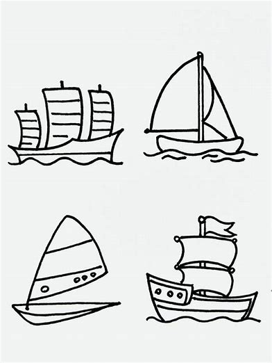

|||-50

 

|||::

Table: .合并单元格

| 节次 | 周一 | 周二 | 周三 |
| :---: | :---: | :---: | :---: |
| 第 1 节 | :r2: 物理实验 | 语文 | 数学 |
| 第 2 节 | \ | 英语 | 体育 |
| :c4: 午休 | \ | \ | \ |
| 第 3 节 | 化学 | 历史 | 生物 |

-|||

```markdown
|||-50

 

|||::

Table: .合并单元格

| 节次 | 周一 | 周二 | 周三 |
| :---: | :---: | :---: | :---: |
| 第 1 节 | :r2: 物理实验 | 语文 | 数学 |
| 第 2 节 | \ | 英语 | 体育 |
| :c4: 午休 | \ | \ | \ |
| 第 3 节 | 化学 | 历史 | 生物 |

-|||
```